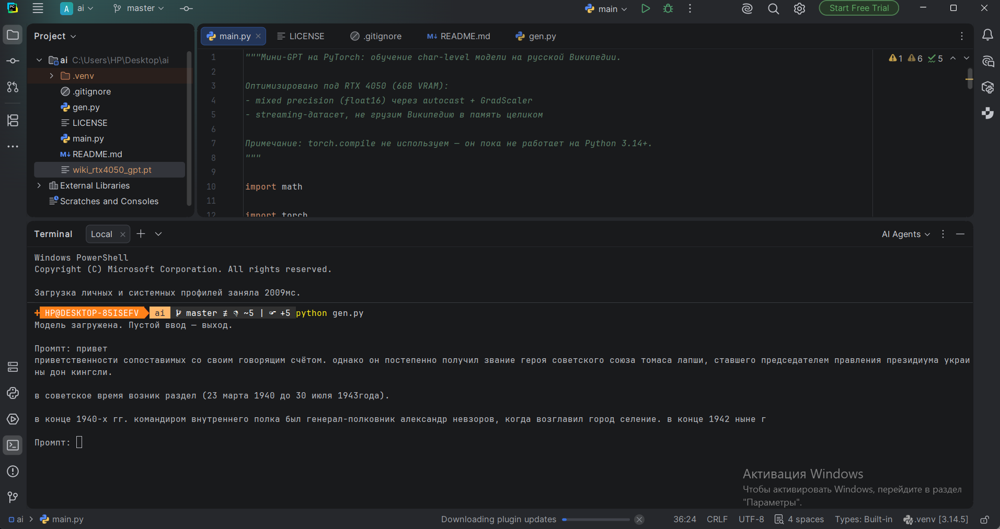

# Мини-GPT на PyTorch

Языковая модель, написанная с нуля и обученная на домашнем ноутбуке с RTX 4050.
Генерирует русские тексты в стиле Википедии посимвольно.

## Результаты

| Модель | Параметры | Шагов | Время | Loss | Что выдаёт |
|---|---|---|---|---|---|
| v1 (4 слоя, d=256) | ~3.4M | 30 000 | 40 мин | 1.34 | Грамотные слова, фантазийные факты |
| v2 (8 слоёв, d=512) | 25.40M | 100 000 | 5 ч 46 мин | 1.08 | Связные фразы в стиле энциклопедии |

Пример генерации (v2, промпт «1991 год», temperature=0.8):

> 1991 году на бюджетном заводе произведено 1771 университет и 5 библиотек.
>
> биография
> родился в комсомольске в семье поэта аристотеля (комсомола)... учился в
> кемеровском университете

Грамматика и стиль статьи выучены, факты — нет. Это честный потолок
char-level модели на 25M параметров: язык — да, знания — нет.
## Еще пример

## Как запустить

```bash
pip install torch --index-url https://download.pytorch.org/whl/cu128
pip install datasets tqdm

python main.py    # обучение (см. Config в начале файла)
python gen.py     # интерактивная генерация с чекпоинта
```

Требования: NVIDIA GPU с CUDA, ~4 GB VRAM для конфигурации по умолчанию.

## Устройство проекта

```
main.py   — архитектура + обучение (всё в одном файле, см. Config)
gen.py    — загружает wiki_rtx4050_gpt.pt, генерирует по введённому промпту
```

Архитектура — упрощённый GPT: causal self-attention (одноголовое),
пре-LayerNorm блоки с residual connections, FFN 4×d, сэмплирование
с temperature и top-k.

Обучение: AdamW, cosine schedule с warmup, клиппинг градиентов,
mixed precision (float16 + GradScaler), стриминг статей Википедии
без загрузки датасета в память.

## Чему я научился

- трансформер изнутри: маскировка внимания, масштабирование на √d,
  зачем residual connections и LayerNorm;
- mixed precision и зачем нужен GradScaler;
- как читать loss-кривую и когда модель уперлась в потолок ёмкости;
- отладка окружения: CPU-сборка torch, `torch.compile` не работает
  на Python 3.14+, скриптовые датасеты удалены из новых `datasets`;
- узкая шина 96 бит (192 ГБ/с) — главное слабое место RTX 4050,
  но для моделей такого размера не критично.

## Идеи на будущее

- [ ] BPE-токенизатор вместо посимвольного (уберёт артефакты вида «19051905»)
- [ ] обучение на новостях (lenta-ru-news) — живой язык вместо энциклопедии
- [ ] multi-head attention
- [ ] графики loss из логов

# Ссылка на веса модели
https://drive.google.com/file/d/1kFMLYC2e4DqexLPgavB7213dhdR9xE-s/view?usp=drive_link
